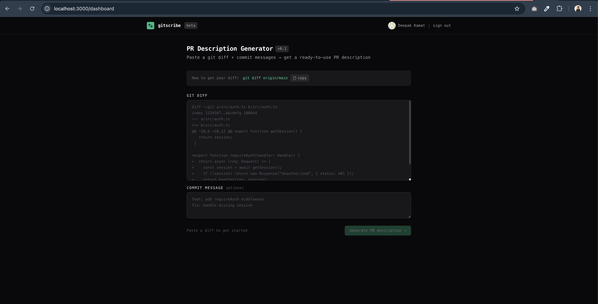

<h1 align="center">GitScribe</h1>

<p align="center">
  <b>Generate pull request descriptions from your git diff using AI.</b>
</p>

<p align="center">
  Write better PR descriptions in seconds instead of minutes.
</p>

<p align="center">
  
  
  
  
  
  
  
</p>

---

## Demo




## What GitScribe Does

GitScribe automatically generates structured GitHub Pull Request descriptions from your git diff.

Instead of manually writing descriptions for every PR, developers can paste their diff and GitScribe will generate:

- **Summary**
- **Change breakdown**
- **Testing instructions**
- **Potential risks**

This helps reviewers quickly understand what changed and why.

## Example Workflow

Run:

```bash
git diff origin/main
```

Paste the diff into GitScribe and generate:

```
## Summary
Adds rate limiting to prevent excessive API usage.

## Changes
- Added Redis client
- Implemented request limiter
- Updated API middleware

## Testing
- Confirmed rate limits trigger after threshold
- Verified Redis key expiration works correctly

## Risks
Minimal risk as changes are isolated to API layer.
```

Copy → paste into GitHub PR.

## Live Beta

GitScribe is currently in **public beta**.

Try it here: **https://gitscribe.vercel.app**

Beta users receive:

- **20 PR generations per day**

Limits exist to prevent abuse while the product is tested with real developers.

## Tech Stack

**Frontend**
- Next.js (App Router)
- Tailwind CSS

**Authentication**
- NextAuth
- GitHub OAuth

**Backend**
- Next.js API routes
- AI Auth API

**Infrastructure**
- Vercel hosting
- Upstash Redis (rate limiting)

## Architecture

```
User
 ↓
Next.js frontend
 ↓
NextAuth (GitHub OAuth)
 ↓
API Route /generate
 ↓
Rate Limiter (Upstash Redis)
 ↓
Gemini AI
 ↓
Generated PR Description
```

The entire system is serverless and horizontally scalable.

## Local Development

Clone repository:

```bash
git clone https://github.com/your-username/gitscribe.git
cd gitscribe
```

Install dependencies:

```bash
npm install
```

Create environment variables:

```bash
cp .env.example .env.local
```

Example configuration:

```
NEXTAUTH_SECRET=your_secret
NEXTAUTH_URL=http://localhost:3000

GITHUB_ID=github_oauth_client_id
GITHUB_SECRET=github_oauth_secret

GEMINI_API_KEY=your_gemini_api_key

UPSTASH_REDIS_REST_URL=your_upstash_url
UPSTASH_REDIS_REST_TOKEN=your_upstash_token
```

Run development server:

```bash
npm run dev
```

Visit: `http://localhost:3000`

## Deployment

GitScribe is deployed using **Vercel**.

Steps:

1. Push project to GitHub
2. Import repository into Vercel
3. Configure environment variables
4. Deploy

Production environment variable example:

```
NEXTAUTH_URL=https://gitscribe.vercel.app
```

GitHub OAuth callback must be:

```
https://gitscribe.vercel.app/api/auth/callback/github
```

## Roadmap

Upcoming features planned for GitScribe.

**GitHub PR Integration**
Generate descriptions directly from a PR URL. No copy-paste required.

**Chrome Extension**
Generate PR descriptions inside the GitHub interface.

**Custom PR Templates**
Support organization-specific PR formats. Example template:

```
Summary
Changes
Screenshots
Testing
Checklist
```

**PR History**
View previously generated PR descriptions.

**Team Features**
Allow teams to standardize PR formats across repositories.

**Paid Plans**
Higher generation limits and advanced features.

## Security

GitScribe does not permanently store repository code.

Diffs are:

- Processed temporarily
- Used only for AI generation
- Not stored in long-term databases

## Contributing

Contributions are welcome.

Steps:

1. Fork the repository
2. Create feature branch
3. Submit pull request

For large changes please open an issue first.

## Feedback

Developer feedback is extremely valuable during the beta phase.

If you encounter issues or have feature ideas:

- Open a GitHub issue
- Share feedback through the application

## License

MIT License

---

**Built for Developers**

GitScribe aims to remove friction from code reviews and improve how developers communicate code changes.

If you find GitScribe useful, consider giving the repository a ⭐.
